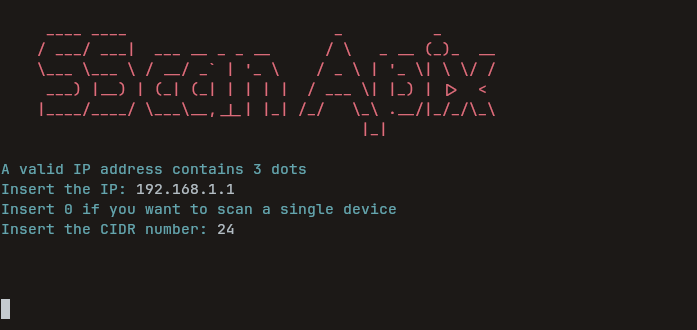
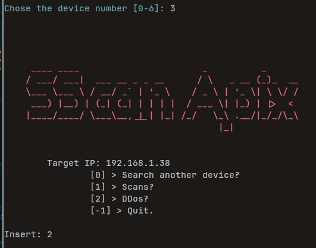
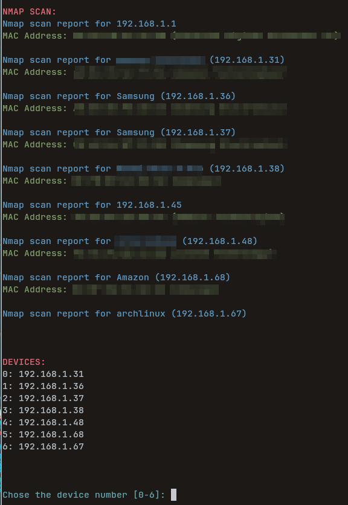

# Welcome to SScan
SScan is a software made in python with a simple and user-friendly CUI that can scan and do specific operations on the selected device in your wifi connection.
SScan uses nmap, hping3 and other packages.

## Screenshots 
### Intro

### Menu

### Result 

